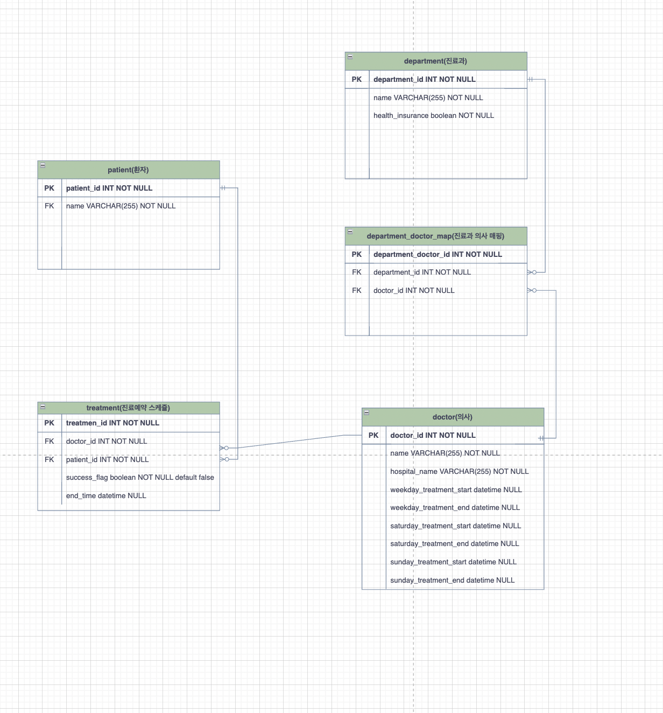

### 개발환경
```
Os: m1 Mac
Db: mysql 8.x
Language: python 3.9.x
Web_Framework: Django 4.1.6
```


### 프로젝트 세팅 방법

.env파일 세팅
```
# 
# 경로 - 프로젝트 root디렉토리
# 아래는 .env파일의 구성예시이며 ?에 DB정보를 채워 실행하시면 됩니다.
-----------
DB_HOST=?
DB_PORT=?
DB_USERNAME=?
DB_PASSWORD=?
DB_NAME=?
-----------

# 가상환경 설치 및 실행
python3 -m venv .venv
source .venv/bin/activate

# pip upgrade
python3 -m pip install --upgrade pip

# 의존성 설치
pip install -r requirements.txt

# django 실행
python3 manage.py runserver
```


### Description

<b>db 다이어그램</b>



```
api 설명

  GET '/doctor' : 의사 검색 API
    입력:
        *필수*
            params = {
                "flag": 'string' or 'date' - string,
            }
        *선택* - 두 파라미터 중 하나를 보냅니다.
            params = {
                "string": string - 검색할 문자열,
                "date": string - 특정 날짜와 시간,
            }
    출력:
        res.body = [
            {
                "id": number,
                "name": string,
                "hospital_name": string,
                "weekday_treatment_start": time,
                "weekday_treatment_end": time,
                "saturday_treatment_start": time,
                "saturday_treatment_end": time,
                "sunday_treatment_start": time,
                "sunday_treatment_end": time,
                "lunch_start": time,
                "lunch_end": time
            }
        ]
    로직:
        string(키워드 검색 로직): 
            1. 각 키워드들마다 해당되는 의사의 데이터를 조회합니다.
            2. 각 키워드들 마다 조회된 의사의 데이터를 교집합 연산을 진행
            3. 모든 키워드 조건을 만족하는 의사의 데이터를 반환합니다.
        date(날짜 검색 로직):
            1. 정규표현식을 사용해 년, 월, 일, 시간의 데이터를 파싱합니다.
            2. date().weekday()메서드를 사용해 해당 날짜가 무슨 요일인지 알아냅니다.
            3. get_weekday_by_str함수를 사용해 해당 날짜가 평일, 토, 일 중 어느 조건에 해당하는지 반환합니다.
            4. 그 후 평일, 토, 일 중 해당하는 조건에 영업하는 의사의 데이터를 필터링합니다.
            5. json 형태로 데이터를 직렬화한 후 반환합니다.


  POST '/treatment' : 진료요청 API
    입력:
        *필수*
        body = {
            "patient_id": number - 환자의 id값,
            "doctor_id": number - 의사의 id값,
            "year": number - 진료 희망 년도,
            "month": number - 진료 희망 월,
            "day": number - 진료 희망 일,
            "hour": number - 진료 희망 시간,
            "minutes": number - 진료 희망 분
        }

    출력:
        res.body = {
            "treatment_id": number,
            "doctor_name": string,
            "patient_name": string,
            "treatement_day": datetime,
            "expiration_day": datetime
        }

    로직:
        1. 입력된 날짜, 시간 데이터를 사용해 요일, 진료희망 시간, 현재 날짜, 현재 시간을 구합니다.
        2. get_treatement_date함수를 사용해 특정 의사의 영업시간인지 확인합니다.
            1. 의사의 영업시간이 아닐경우 예외처리
        3. get_expiration_date함수를 사용해 현재 날짜, 시간을 기반으로 진료요청 만료 날짜,시간을 구합니다.
        4. 진료 요청 데이터를 db에 적재합니다.
        5. 진료 요청 데이터를 반환합니다.


  GET '/treatment' : 진료요청 검색 API
    입력:
        *필수*
        body = {
            "doctor_id": number - 의사의 id값
        }

    출력:
        res.body = [
            {
                "treatment_id": number,
                "doctor_name": string,
                "success_flag": boolean,
                "patient_name": string,
                "treatment_time": datetime,
                "end_time": datetime
            }
        ]
    로직:
        1. doctor_id값을 가지고, 아직 진료요청 수락이 되지 않은 진료요청 데이터를 조회합니다.
        2. 조회한 진료요청 데이터를 직렬화하여 반환합니다.


  PUT '/treatment' : 진료요청 수락 API
    입력:
        *필수*
        params = {
            "treatment_id": number - 진료요청 id값,
        }
    
    출력:
        res.body = {
            "treatment_id": number,
            "patient_name": string,
            "treatment_time": datetime,
            "end_time": datetime
        }

    로직:
        1. 입력된 진료요청 id값으로 특정 진료요청 데이터를 조회합니다.
        2. 특정 진료요청을 수락 상태로 수정합니다.
            1. 해당 id값을 가진 진료요청 데이터가 없으면 예외처리
        3. 수정된 진료요청 데이터 직렬화한 후 반환 
  
```    